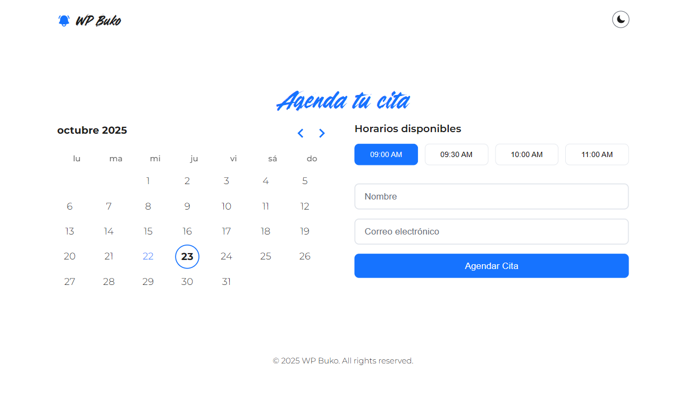
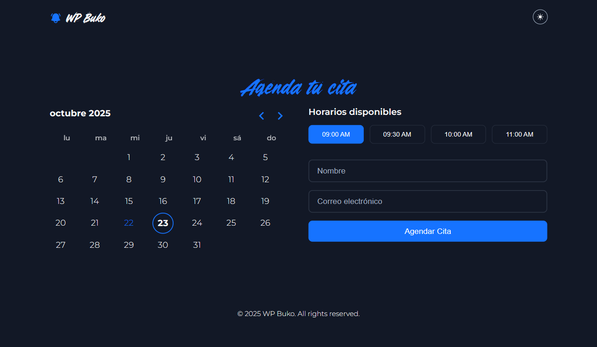

# WP Buko WordPress Theme

## Project Overview

WP Buko is a custom WordPress theme built with Gutenberg blocks, featuring appointment scheduling, dark/light mode toggling, and responsive design. It uses React components for dynamic functionality and includes custom blocks for logos, toggles, and scheduling.

## Screenshots

### Light Mode

### Dark Mode

## Features

- **Appointment Scheduling Component**: A React-based component that integrates with a calendar picker (using react-day-picker) to select dates and available time slots. Users can book appointments by filling out a form with name and email fields. The component handles loading states, success/error messages, and automatically refreshes available slots after a successful booking to prevent double-booking.
- **Form Handling**: Includes input validation, form clearing after submission, and dynamic button states (e.g., "Agendando..." during loading).
- **Success/Error Messages**: Displays localized messages for booking outcomes, with customizable text via attributes.
- **Theme Modes**: Supports light and dark modes with a toggle block that switches the site's color scheme. The theme uses CSS custom properties for consistent theming.
- **Responsive Layout**: Sticky header and footer with a centered main content area that fills the viewport height, ensuring content is vertically and horizontally centered. The layout adapts to content overflow with proper scrolling.
- **Custom Blocks**: Includes blocks for logo display, dark mode toggle, and schedule appointment forms.
- **Accessibility**: Implements proper ARIA attributes, keyboard navigation, and color schemes that respect user preferences.

## Installation

1. Download or clone the WP Buko theme repository into your WordPress themes directory (`wp-content/themes/`).
2. Activate the theme through the WordPress admin dashboard under **Appearance > Themes**.
3. Ensure the following dependencies are installed:
   - WordPress 5.0 or higher (for Gutenberg support).
   - Node.js and npm for building assets (if customizing).
4. Install required plugins if any (none specified, but ensure API endpoints for scheduling are set up via custom routes in `inc/routes.php`).
5. Build assets by running `npm install` and `npm run build` in the theme root directory.

## Usage

- **Theme Setup**: After activation, use the WordPress block editor to add content. The theme's template parts (header and footer) are automatically included.
- **Adding Blocks**: Insert custom blocks like "WP Buko Logo", "Dark Mode Toggle", and "Schedule Appointment" via the block inserter.
- **Scheduling Appointments**: Configure the schedule block with attributes for labels, placeholders, and messages. The component fetches available slots via API and handles bookings.
- **Customization**: Modify styles in `assets/css/main.css` or SCSS files in `src/blocks/`. Use WordPress customizer for global settings.
- **API Integration**: Ensure the backend API (defined in `inc/routes.php`) handles `/wp_buko/v1/available` and `/wp_buko/v1/book` endpoints for slot fetching and booking.

## File Structure

The theme follows a modular structure for maintainability:

- `functions.php`: Main theme functions and setup.
- `style.css`: Theme metadata and basic styles.
- `theme.json`: Theme configuration for Gutenberg.
- `templates/index.html`: Main template with header, main content, and footer.
- `parts/header.html`: Sticky header template part with logo and dark mode toggle.
- `parts/footer.html`: Sticky footer template part with copyright information.
- `assets/css/main.css`: Compiled styles including layout, typography, and component styles.
- `assets/css/admin.css`: Admin-specific styles.
- `assets/css/editor.css`: Editor-specific styles.
- `assets/js/main.js`: Main JavaScript file.
- `assets/fonts/`: Custom fonts (e.g., Driftline.ttf).
- `inc/`: Includes for enqueueing, options, block registration, routes, and setup.
- `src/blocks/`: Source files for custom blocks (e.g., schedule-appointment, logo, dark-mode-toggle).
- `src/components/`: React components (e.g., Schedule.js for appointment handling).

## Technical Details

- **Styling**: Utilizes CSS custom properties for colors and spacing. Supports both light and dark schemes via the `color-scheme` property.
- **Dependencies**: Relies on `@wordpress/element`, `@wordpress/api-fetch`, and `react-day-picker` for React components.
- **Performance**: Assets are enqueued conditionally, and the theme minimizes external requests.

For further customization or contributions, refer to the source code and WordPress developer documentation.
